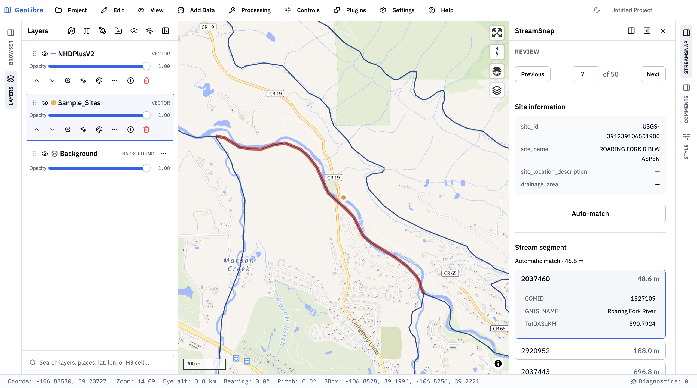

# StreamSnap

StreamSnap is a [GeoLibre](https://geolibre.app/) plugin for interactively matching river-monitoring sites to
stream segments and creating snapped site points.



> [!WARNING]
> This project is built with intensive agentic programming and should be considered as experimental.

## Workflow

1. In **Settings** of the StreamSnap plugin panel, choose two layers (a point layer `sites` and a line layer `streams`), the visible attributes, one unique primary key for each
   layer, and the maximum segment distance (1,000 m by default). Primary-key attributes are always
   visible.
2. Select **Start reviewing**. Settings are then locked for the review.
3. Each site is automatically matched only when first visited. Use **Auto-match** to recompute that
   site, choose another distance-sorted segment in the panel or on the map, or enter a site number
   in the review navigation and press Enter to jump to it.
4. After every site has been reviewed, select **Generate snapped sites** to add one
   `{sites}_snapped` layer to the workspace. Review remains editable; once that layer exists,
   **Regenerate snapped sites** replaces it with the latest matches.

GeoLibre exposes workspace vectors in WGS84. StreamSnap therefore uses geodesic metres everywhere
instead of exposing a CRS-dependent degree value.

## Example Data
Use [`sample_sites.parquet`](./sample_sites.parquet) in this repo and [NHDPlus V2 stream segments](https://services.arcgis.com/P3ePLMYs2RVChkJx/ArcGIS/rest/services/NHDPlusV21/FeatureServer/2).

## Output

The output keeps the source-site feature order and ids.
Matched sites move to the chosen stream; unmatched sites remain at their original coordinates with
null match fields.

| Field                  | Meaning                                                                      |
| ---------------------- | ---------------------------------------------------------------------------- |
| `site_primary_key`     | Value of the configured Sites primary key                                    |
| `stream_primary_key`   | Value of the selected Streams primary key, or `null`                         |
| `snapped_stream_index` | Selected feature position in the loaded Streams snapshot, or `null`          |
| `snap_distance_m`      | Site-to-stream distance in metres, or `null`                                 |
| `manual_revised`       | `true` only when the final segment differs from that site's automatic result |

## Local development

Requires Node.js 22+ and pnpm 11.

```bash
pnpm install
pnpm build # add `--watch` for rebuild-on-save dev
pnpm serve:geolibre # add a number, e.g., 8123 to use a different port
```

Open [GeoLibre Web](https://web.geolibre.app/), then go to **Settings → Manage Plugins → Settings**
and add `http://localhost:8000/plugin.json` as a manifest URL.

You may also use

```bash
pnpm package:geolibre
```

to create a `geolibre-plugin/streamsnap-<version>.zip`, which can be installed with **Install from
file**. `pnpm install:geolibre` builds and copies the unpacked bundle to GeoLibre Desktop's default
app-data plugin directory.
